# CI/CD

## Video


## Settings

### Ngrok

```sh
ngrok config add-authtoken <token>
ngrok http http://localhost:8080
```

### Jenkins

- System

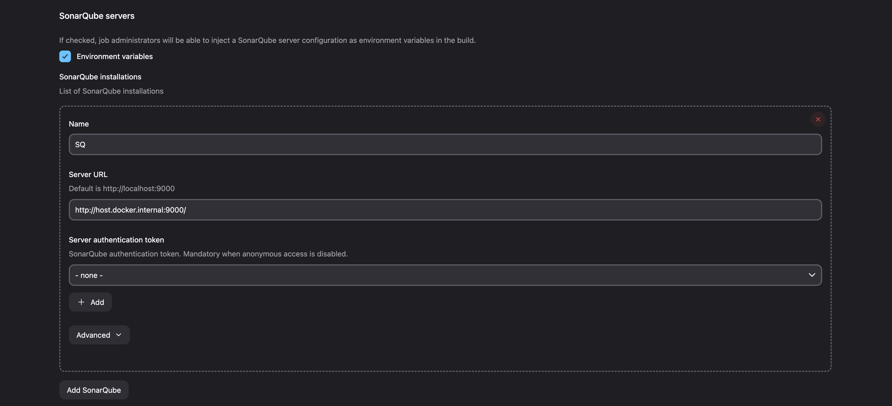

- Tools

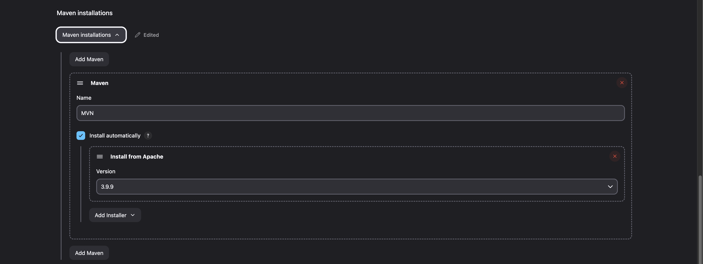
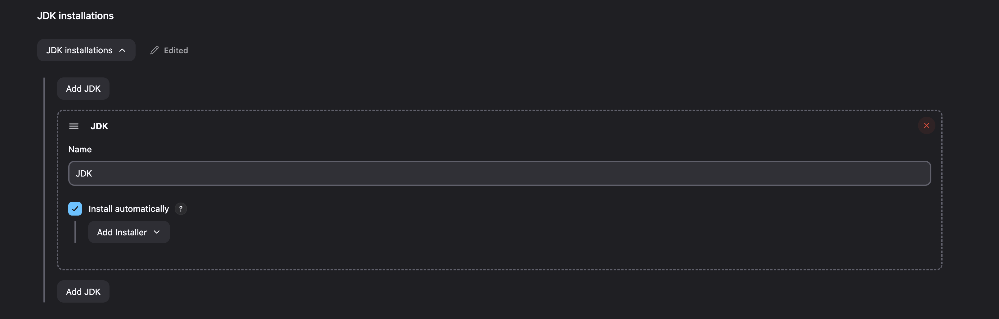
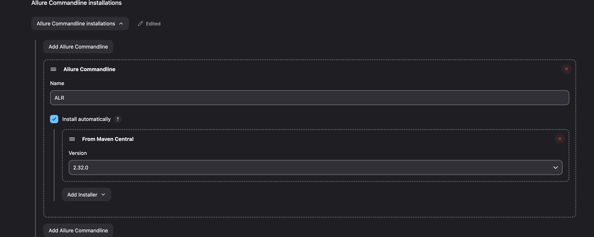

- Cred

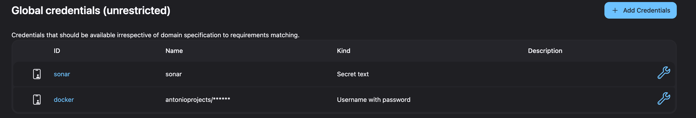

### SonarQube

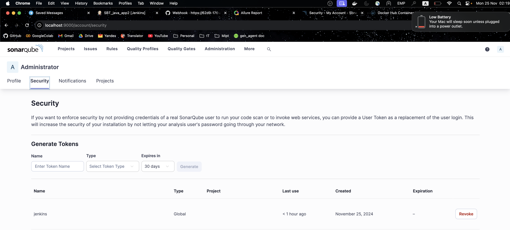

### GitHub

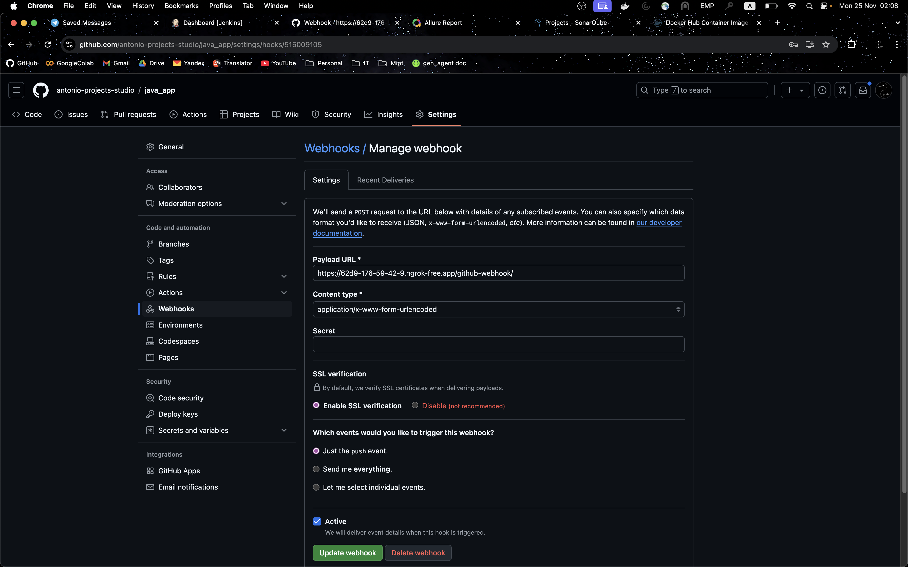

## CI

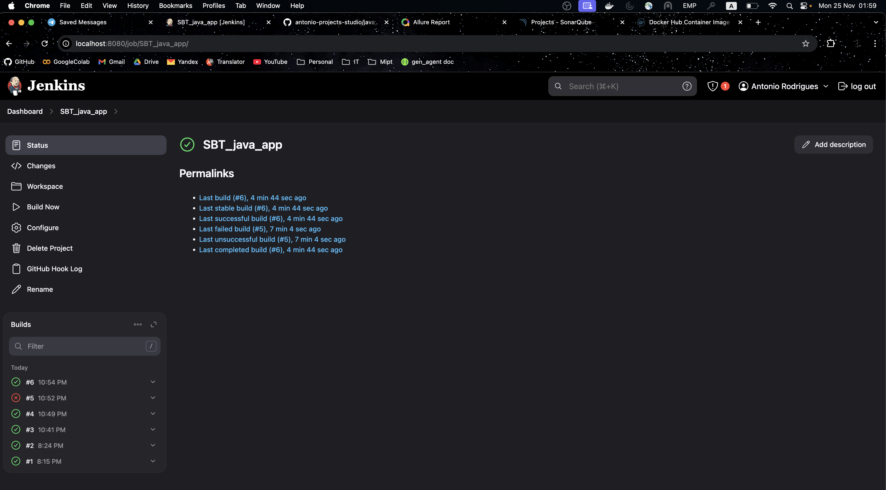

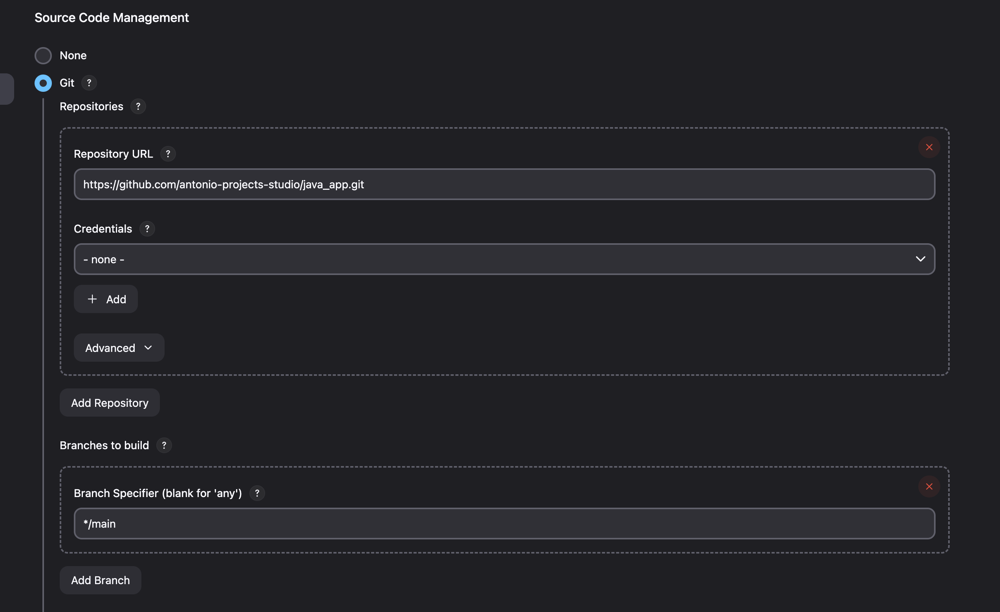

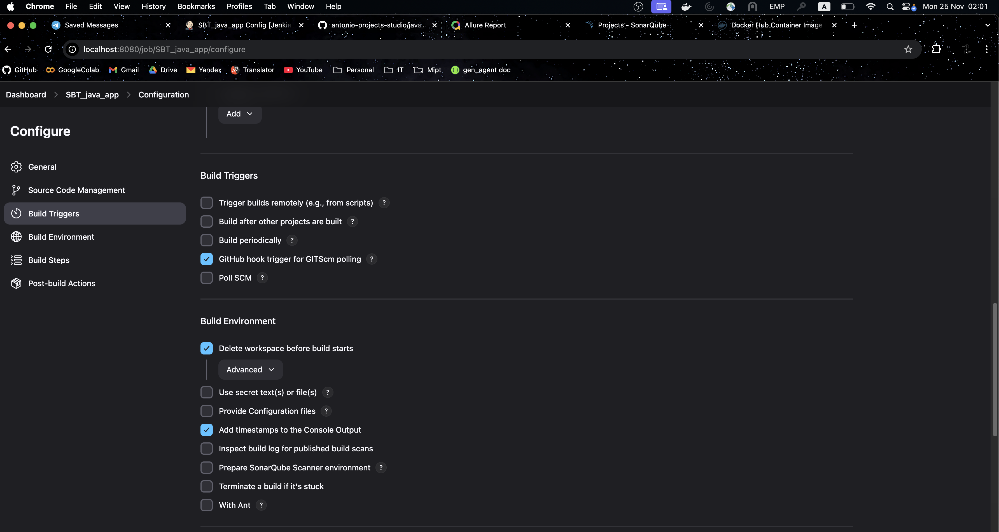

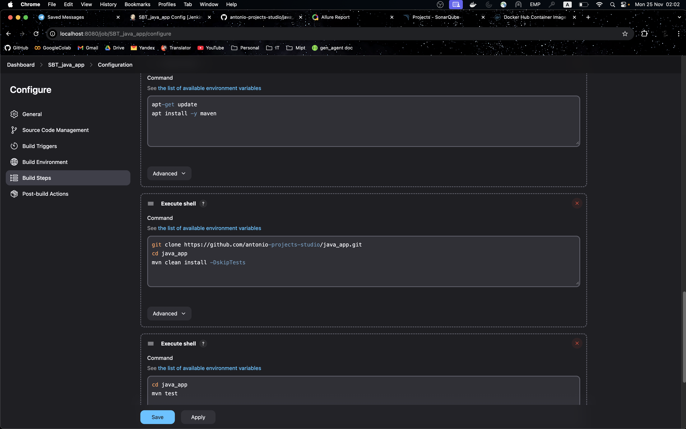

## CD

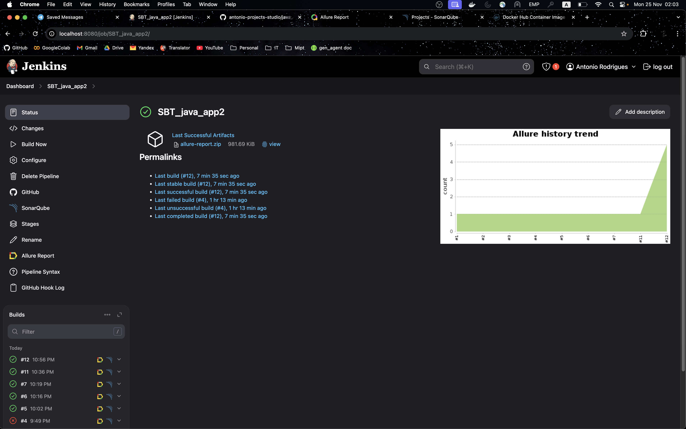

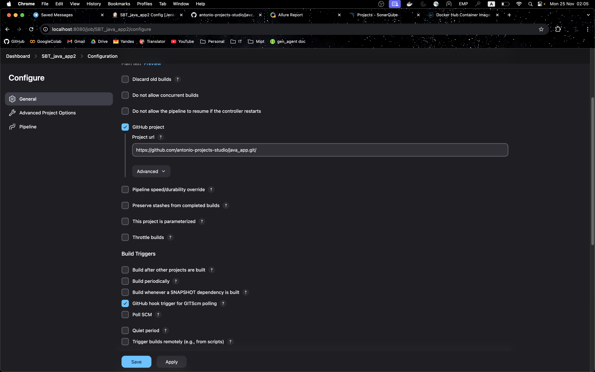

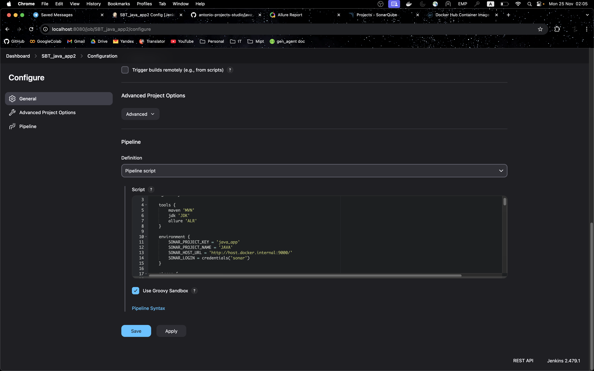

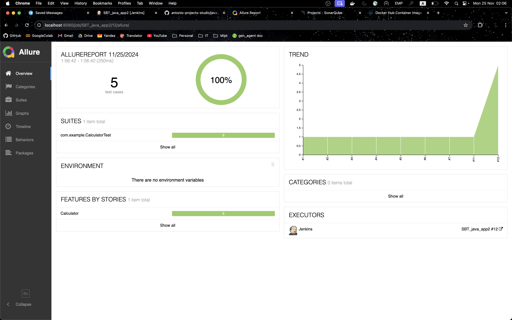

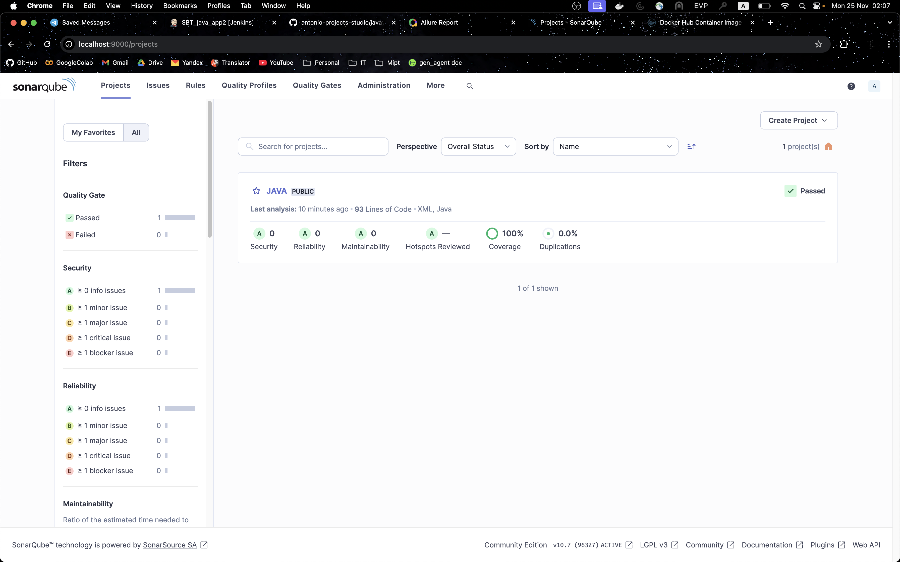